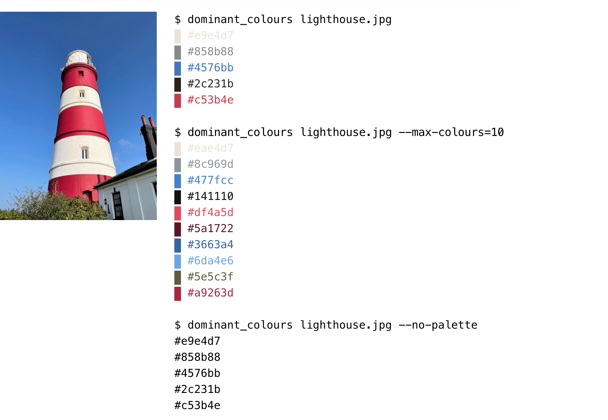

# dominant_colours

This is a tool for finding the dominant colours of an image.
It prints their hex codes to the terminal, along with a preview of the colour (in terminals that support ANSI escape codes):



It's available both as a command-line tool and [as a web app](./webapp).


## Installation

You can download compiled binaries from the [GitHub releases](https://github.com/alexwlchan/dominant_colours/releases).

Alternatively, you can install from source.
You need Rust installed; I recommend using [Rustup].
Then clone this repository and compile the code:

```console
$ git clone "https://github.com/alexwlchan/dominant_colours.git"
$ cd dominant_colours
$ cargo install --path .
```

[Rustup]: https://rustup.rs/


## Usage examples

Pass the path of an image you want to look at:

```console
$ dominant_colours /path/to/cats.jpg
▇ #d0c6b2
▇ #3f3336
▇ #f3f2ee
▇ #786356
▇ #aa9781
```

By default, it finds (up to) five dominant colours.
If you want more or less, pass the `--max-colours` flag.
For example:

```console
$ dominant_colours /path/to/corgis.jpg --max-colours=3
▇ #7c8442
▇ #ccbe8f
▇ #2d320e
```

The colours are printed as hex codes, with colour previews in your terminal.
If you just want the hex codes and no colour preview, pass the `--no-palette` flag:

```console
$ dominant_colours /path/to/crustaceans.png --no-palette
#e6401b
#be5e36
#734f48
#d6c0bd
#b1948f
```

This is useful if your terminal doesn't support ANSI escape codes, or you're passing the output to another tool.

It currently supports JPEGs, PNGs, and GIFs (including animated GIFs).


## Further reading

-   I've written [an accompanying blog post](https://alexwlchan.net/2021/11/dominant-colours/) that talks more about the motivation behind the tool, a high-level overview of how it works, and why I chose to write it in Rust.

-   [Getting a tint colour from an image with Python and k-means](https://alexwlchan.net/2019/08/finding-tint-colours-with-k-means/) – a blog post I wrote in August 2019 explaining how to find dominant colours.

    My original implementation was in Python.
    I've replaced it with a standalone Rust tool so I can easily share it across multiple projects, and because Rust is noticeably faster for this sort of thing.

-   [Collyn O'Kane's kmeans-colors project](https://github.com/okaneco/kmeans-colors) – a Rust command-line tool and library for finding the average colours in an image using k-means.

    The command-line tool has a lot of features, more than I need.
    I wanted a very simple tool that does one thing, so I wrote dominant_colours as a wrapper around the library.

-   [Drawing coloured squares/text in my terminal with Python](https://alexwlchan.net/2021/04/coloured-squares/) – a blog post I wrote in April 2021 explaining how to use ANSI escape codes to print arbitrary colours in a terminal.

    I used the same escape codes to get the coloured output in this tool.


## License

MIT.
